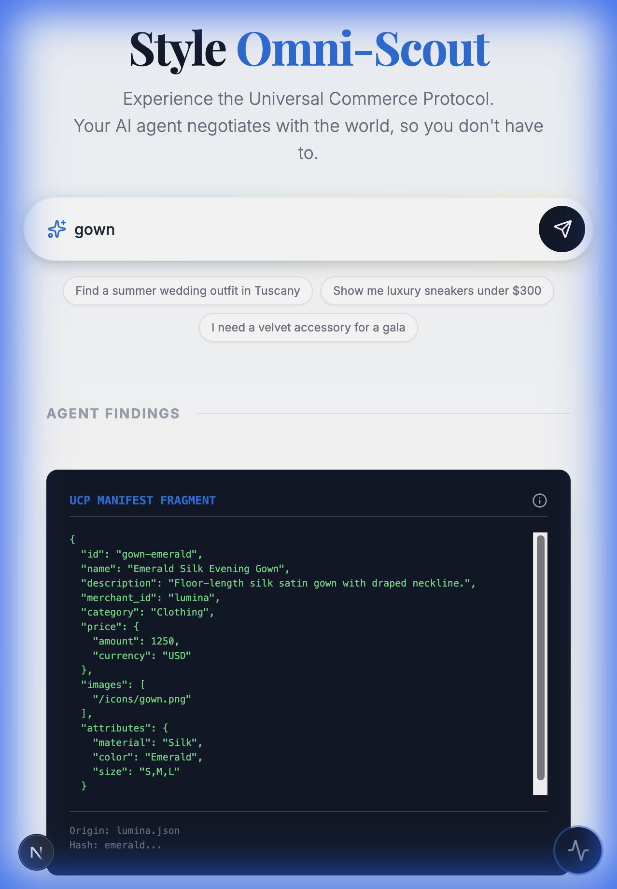
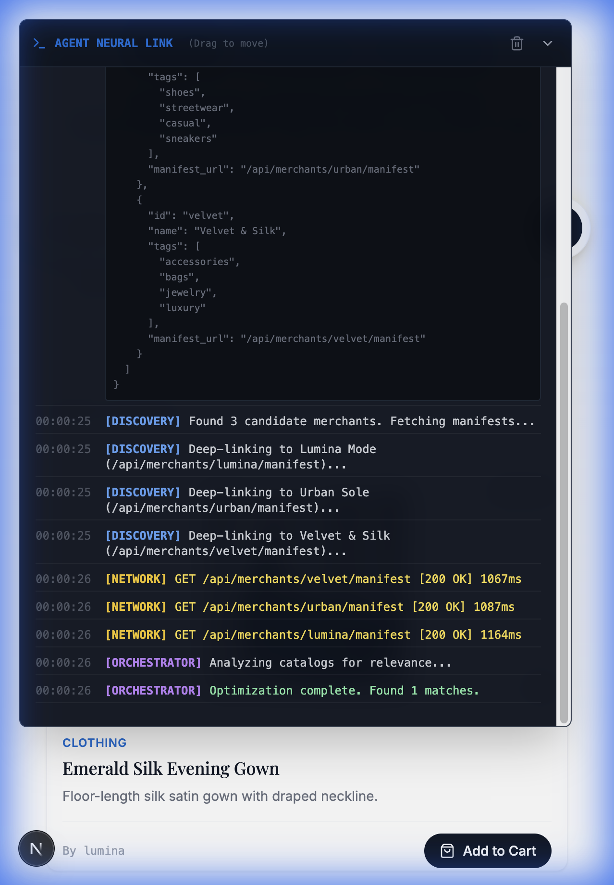

# UCP "Style Omni-Scout" Prototype

A "Generative UI" commerce prototype demonstrating the **Universal Commerce Protocol (UCP)**. This application simulates a next-generation "Commerce Superapp" that aggregates products from a distributed network of merchants using autonomous agents.

## 📺 Demo Walkthrough

<div align="center">
  <video src="./demo-assets/demo.webp" controls width="100%"></video>
</div>

## 🌟 Key Features

### 1. Consumer Layer (Generative UI)
The user interface is clean, premium, and dynamically generated based on user intent. It hides the complexity of the underlying protocol.


### 2. Protocol Layer (Inspector Mode)
By clicking the `< >` icon on any product, you can "flip" the card to verify the authentic **UCP Manifest**. This proves that the data comes directly from the merchant's self-sovereign data store, not a centralized database.



### 3. Agent Neural Link (Observability)
A real-time debug overlay shows the "Brain" of the Scout Agent. Watch as it:
*   **Broadcasts** intent to the Registry.
*   **Discovers** merchant endpoints.
*   **Fetches** and filters distributed manifests.
*   **Orchestrates** the final UI presentation.



## 🚀 How It Works

1.  **Registry Lookup**: The app queries `/api/ucp/registry` to find simulated merchants (Lumina, Urban, Velvet).
2.  **Distributed Fetch**: The Agent hits each merchant's unique endpoint (e.g., `/api/merchants/lumina/manifest`) to fetch their live catalog.
3.  **Local Intelligence**: The `OmniScoutAgent` (client-side) filters and ranks these products based on your search query.
4.  **Rendering**: The UI renders the verified data into premium product cards.

## 🛠️ Tech Stack

*   **Framework**: Next.js 16 (App Router)
*   **Styling**: Tailwind CSS v4
*   **State**: Zustand (Agent Logs)
*   **Icons**: Lucide React
*   **Images**: AI Generated (Gemini)

## 🏃‍♂️ Running Locally

```bash
npm install
npm run dev
# Open http://localhost:3000
```
